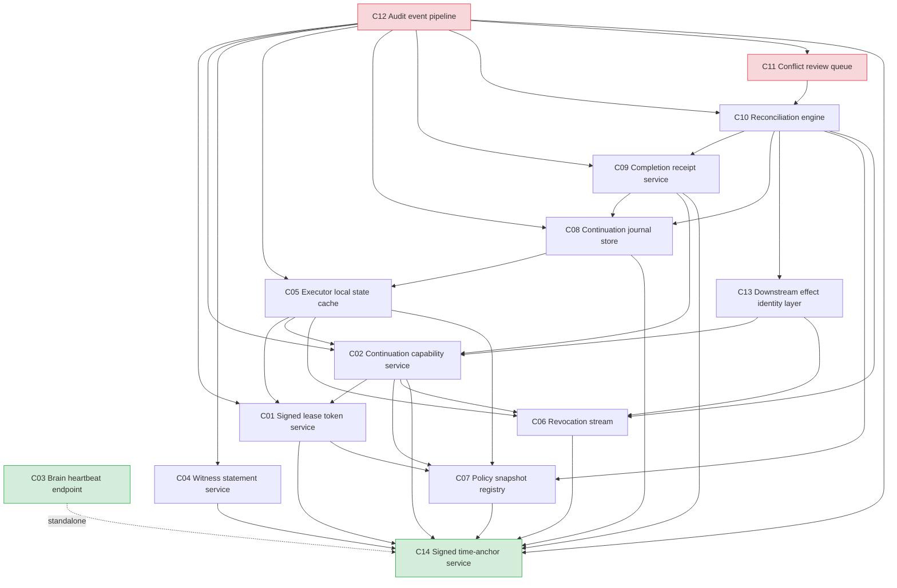

# 02 — Component Dependency Graph

**Package:** Executor Continuation Implementation Planning
**Source of truth:** ADR-MC-001 (ACCEPTED, merged to main), Section 9.1 "Required Components"
**Artifact type:** Planning only — no runtime code, no deployment, no authority activation
**Scope:** This document maps the build-time and validation-time dependencies among the 14 required components listed in ADR-MC-001 §9.1. It does not implement, deploy, or unblock `SIGMA_LEASE_EXPIRY_CONTINUATION_GATE`.

---

## 1. Component Inventory

The 14 required components from ADR-MC-001 §9.1, each assigned a short ID for use in the graphs and tables below.

| ID | Component | ADR §9.1 Purpose |
|----|-----------|------------------|
| C01 | Signed lease token service | Issue, renew, and revoke signed lease tokens |
| C02 | Continuation capability service | Issue, validate, and revoke signed continuation capabilities |
| C03 | Brain heartbeat endpoint | Allow executors to detect Brain availability |
| C04 | Witness statement service | Publish and validate signed witness statements |
| C05 | Executor local state cache | Store inputs, configuration, and prior step outputs |
| C06 | Revocation stream | Publish lease revocations, cancellations, and emergency denies |
| C07 | Policy snapshot registry | Pin and validate policy snapshots by hash |
| C08 | Continuation journal store | Immutable per-continuation operation log |
| C09 | Completion receipt service | Generate and verify signed continuation receipts |
| C10 | Reconciliation engine | Classify and resolve continuation reports (result selection, effect reconciliation, compensation, manual review) |
| C11 | Conflict review queue | Surface conflicting continuation results for operators |
| C12 | Audit event pipeline | Append continuation events to immutable audit ledger |
| C13 | Downstream effect identity layer | Validate `(command_id, operation_id, side_effect_slot)` before applying effects |
| C14 | Signed time-anchor service | Issue and validate signed wall-clock anchors |

---

## 2. Dependency Model

Dependencies are derived from the ADR-MC-001 normative sections:

- **C14 (time-anchor)** is referenced by §2.8 as the trusted clock source for *all* lease, capability, revocation, witness, and reconciliation timestamps. Every signed artifact carries a signed anchor; therefore C14 is a dependency of every signing or timestamp-validating component.
- **C07 (policy snapshot)** is pinned inside the capability (§2.1.4, §2.11) and validated by hash; lease issuance references `policy_snapshot_id` (§2.1.1).
- **C06 (revocation stream)** is required for capability revocation (§2.1.4), the watermark model (§2.10), and reconciliation (§2.6).
- **C03 (heartbeat)** is one of the direct-Brain outage signals (§2.2.1) and the recovery notification channel (§2.6.1). It has no build-time dependency on the other 13 components.
- **C13 (effect identity)** is consumed by downstream systems (§2.5) and by the reconciliation engine (§2.6.3.2).
- **C12 (audit pipeline)** is the sink for every event in the §2.13 audit chain; it depends on the producers, not the reverse.

### 2.1 Dependency Notation

`A --> B` means "A depends on B" (B must exist and be usable before A can be built or validated). A directed edge from A to B indicates B is a prerequisite of A.

---

## 3. ASCII Dependency Graph

```text
                          +-----------------------+
                          |  C14 Signed time-anchor|
                          |       service          |
                          +-----------+-----------+
                                      |
       (every signed/timestamped artifact depends on C14)
                                      |
   +----------------------------------+-----------------------------------+
   |                                  |                                   |
   v                                  v                                   v
+--+-----------+        +-------------+---------+              +-----------+-------+
| C07 Policy   |        | C06 Revocation stream |              | C03 Brain heartbeat|
| snapshot     |        |                       |              | endpoint            |
| registry     |        +-----------+-----------+              +---------------------+
+--+-----------+                    |                                    |
   |                                |                                    |
   |   +----------------------------+    (no further build deps;          |
   |   |                            |     C03 is a standalone signal)   |
   v   v                            v                                    |
+------+-----------+        +--------+---------+                           |
| C01 Signed lease |        | C04 Witness      |                           |
| token service    |        | statement service|                           |
+--------+---------+        +------------------+                           |
         |                                                               |
         |    +----------------------------------------------------------+
         |    |
         v    v
+--------+-----------+
| C02 Continuation    |
| capability service  |<--- also depends on C06 (revocation_watermark_required)
+--------+-----------+<--- also depends on C07 (policy_snapshot_hash)
         |
         |  +-----------------------------+
         |  |                             |
         v  v                             v
+--------+-----------+        +-----------+----------+
| C05 Executor local  |        | C13 Downstream effect|
| state cache         |        | identity layer        |
+--------+-----------+        +-----------+----------+
         |                                |
         v                                |
+--------+-----------+                    |
| C08 Continuation    |                   |
| journal store       |                   |
+--------+-----------+                    |
         |                                |
         v                                |
+--------+-----------+                    |
| C09 Completion      |                   |
| receipt service     |                   |
+--------+-----------+                    |
         |                                |
         v                                v
+--------+--------------------------------+----------+
| C10 Reconciliation engine                           |
| (result selection, effect reconciliation,          |
|  compensation, manual review)                       |
+--------+-------------------------------------------+
         |
         v
+--------+-----------+
| C11 Conflict review|
| queue               |
+---------------------+

                       +-----------------------+
                       | C12 Audit event        |
                       | pipeline (sink for all |
                       | §2.13 audit events)    |
                       +-----------------------+
```

### 3.1 Simplified Layer View

```text
Layer 0 (Foundational):   C14  C03
Layer 1 (Primitives):      C07  C06  C04
Layer 2 (Authority):       C01  C13
Layer 3 (Capability):      C02
Layer 4 (Executor state):  C05  C08
Layer 5 (Reporting):        C09
Layer 6 (Resolution):       C10  C11
Layer 7 (Observability):    C12
```

---

## 4. Mermaid Dependency Diagram



---

## 5. Layered Dependency Table

The table below shows, for each component: its layer, the components it directly depends on (build/validation prerequisites), the components that depend on it (consumers), and its classification.

| ID  | Component | Layer | Directly depends on | Consumed by | Classification |
|-----|-----------|-------|---------------------|-------------|----------------|
| C14 | Signed time-anchor service | 0 Foundational | (none) | C01, C02, C04, C06, C07, C08, C09, C10, C12 | Foundational (root) |
| C03 | Brain heartbeat endpoint | 0 Foundational | (none — standalone signal source) | C05 (outage detection input), C10 (recovery notification) | Foundational (independent) |
| C07 | Policy snapshot registry | 1 Primitives | C14 | C01, C02, C05, C10 | Primitive |
| C06 | Revocation stream | 1 Primitives | C14 | C02, C05, C10, C13 | Primitive |
| C04 | Witness statement service | 1 Primitives | C14 | C05 (outage evidence), C10 (reconciliation evidence), C12 (audit) | Primitive |
| C01 | Signed lease token service | 2 Authority | C14, C07 | C02, C05, C12 | Authority primitive |
| C13 | Downstream effect identity layer | 2 Authority | C02, C06 | C10 | Authority primitive |
| C02 | Continuation capability service | 3 Capability | C01, C07, C06, C14 | C05, C09, C13, C12 | Core authority |
| C05 | Executor local state cache | 4 Executor state | C01, C02, C06, C07 | C08, C12 | Executor state |
| C08 | Continuation journal store | 4 Executor state | C05, C14 | C09, C10, C12 | Executor state |
| C09 | Completion receipt service | 5 Reporting | C08, C02, C14 | C10, C12 | Reporting |
| C10 | Reconciliation engine | 6 Resolution | C09, C08, C13, C07, C06 | C11, C12 | Resolution (hub) |
| C11 | Conflict review queue | 6 Resolution | C10 | C12 | Leaf (operator surface) |
| C12 | Audit event pipeline | 7 Observability | C01, C02, C04, C05, C08, C09, C10, C11, C14 | (terminal sink) | Leaf (terminal sink) |

### 5.1 Notes on the table

- **C14** is listed as a dependency of every signing/timestamp-validating component because ADR §2.8 makes the Brain the authoritative clock source and requires signed anchors at dispatch, renewal, and recovery. For build ordering, treat C14 as a shared primitive that must be available first.
- **C03** has no build-time dependency on the other 13 components. It is a standalone direct-Brain signal source (§2.2.1) and recovery notification channel (§2.6.1). It is foundational because other components consume its output at runtime, but it can be built in parallel with Layer 1.
- **C13** is placed in Layer 2 because it validates effect identity against the capability and revocation state, but it does not itself issue capability; it is a consumer of C02 and C06.
- **C12** is a terminal sink: it depends on every event-producing component but nothing depends on it. It is a leaf in the build-dependency sense, even though it is consumed by operators and downstream audit readers.

---

## 6. Foundational, Leaf, and Independent Components

### 6.1 Foundational components (no build dependencies)

| ID | Component | Why foundational |
|----|-----------|------------------|
| C14 | Signed time-anchor service | Every signed artifact in the ADR is timestamped by the Brain as authoritative clock (§2.8). No other component can be validated without it. |
| C03 | Brain heartbeat endpoint | Standalone direct-Brain signal source (§2.2.1) and recovery notification channel (§2.6.1). No prerequisite among the 14. |

### 6.2 Leaf components (nothing depends on them for build)

| ID | Component | Why a leaf |
|----|-----------|-----------|
| C11 | Conflict review queue | Terminal operator surface; only C12 consumes its events. |
| C12 | Audit event pipeline | Terminal audit sink; no component depends on it for build or validation. |

### 6.3 Components that can be built independently (parallelizable)

The following can be built in parallel *within their layer* because they share no direct dependency on each other:

- **Layer 0:** C14 and C03 are fully independent of each other and of everything else.
- **Layer 1:** C07, C06, and C04 depend only on C14 (and not on each other), so they can be built in parallel once C14 is available.
- **Layer 2:** C01 and C13 share no edge between them; C01 depends on C14+C07, C13 depends on C02+C06. In practice C13 waits on C02, so C01 is the parallelizable one in this layer.
- **Layer 4:** C05 and C08 could be developed in parallel once C02 (for C05) and C05 (for C08) are available; C08 strictly follows C05, so the parallelism is limited to interface definition work.

---

## 7. Critical Path

The critical path is the longest dependency chain that must be completed sequentially before the system can be validated end-to-end.

```text
C14 -> C07 -> C01 -> C02 -> C05 -> C08 -> C09 -> C10 -> C11
```

That is 9 sequential build stages. The critical path is driven by the chain of signed authority (time -> policy -> lease -> capability) flowing into executor state (cache -> journal), then into reporting (receipt), then into resolution (reconciliation -> conflict review).

A secondary near-critical path runs through the revocation stream:

```text
C14 -> C06 -> C02 -> C05 -> C08 -> C09 -> C10 -> C11
```

This is shorter (8 stages) but C06 must be available by the time C02 is built, so C06 should be started in parallel with C07 during Layer 1.

### 7.1 Critical-path rationale

- C14 is first because every signed artifact is anchored to it (§2.8).
- C07 precedes C01 because the lease references `policy_snapshot_id` (§2.1.1) and the capability pins `policy_snapshot_hash` (§2.1.4).
- C01 precedes C02 because the capability is "cryptographically separate from the lease token" (§2.1.4) and binds to the lease via `not_valid_before = lease expires_at`.
- C02 precedes C05 because the executor cache must hold the capability, lease token fingerprint, revocation watermark, and pinned policy (§2.3 eligibility).
- C05 precedes C08 because the journal records operations performed from the local state (§2.5.3).
- C08 precedes C09 because the receipt embeds the encrypted continuation journal (§2.6.2).
- C09 precedes C10 because reconciliation consumes completion reports (§2.6.2, §2.6.3).
- C10 precedes C11 because the conflict review queue is fed by the reconciliation engine's `CONFLICTING_REPORTS` and `MANUAL_REVIEW_REQUIRED` classifications (§2.6.3.4, §2.12.2).

---

## 8. Recommended Build Order

The build order is organized into phases. Within a phase, components may be developed in parallel. A phase may begin only when all prerequisites from prior phases are available (interface-defined and unit-testable).

### Phase A — Foundational (parallel)

| Order | ID | Component | Rationale |
|-------|----|-----------|----------|
| A.1 | C14 | Signed time-anchor service | Everything timestamps against it. |
| A.2 | C03 | Brain heartbeat endpoint | Standalone signal source; no dependency. |

### Phase B — Primitives (parallel after C14)

| Order | ID | Component | Depends on |
|-------|----|-----------|------------|
| B.1 | C07 | Policy snapshot registry | C14 |
| B.2 | C06 | Revocation stream | C14 |
| B.3 | C04 | Witness statement service | C14 |

### Phase C — Authority (sequential within layer)

| Order | ID | Component | Depends on |
|-------|----|-----------|------------|
| C.1 | C01 | Signed lease token service | C14, C07 |
| C.2 | C02 | Continuation capability service | C01, C07, C06, C14 |
| C.3 | C13 | Downstream effect identity layer | C02, C06 |

### Phase D — Executor state (sequential)

| Order | ID | Component | Depends on |
|-------|----|-----------|------------|
| D.1 | C05 | Executor local state cache | C01, C02, C06, C07 |
| D.2 | C08 | Continuation journal store | C05, C14 |

### Phase E — Reporting

| Order | ID | Component | Depends on |
|-------|----|-----------|------------|
| E.1 | C09 | Completion receipt service | C08, C02, C14 |

### Phase F — Resolution (sequential)

| Order | ID | Component | Depends on |
|-------|----|-----------|------------|
| F.1 | C10 | Reconciliation engine | C09, C08, C13, C07, C06 |
| F.2 | C11 | Conflict review queue | C10 |

### Phase G — Observability (can start in parallel with E/F for interface, completes last)

| Order | ID | Component | Depends on |
|-------|----|-----------|------------|
| G.1 | C12 | Audit event pipeline | C01, C02, C04, C05, C08, C09, C10, C11, C14 |

### 8.1 Build-order summary

```text
A: [C14, C03]                         (parallel)
B: [C07, C06, C04]                    (parallel, after C14)
C: C01 -> C02 -> C13                  (sequential)
D: C05 -> C08                         (sequential)
E: C09                                (after D)
F: C10 -> C11                         (sequential)
G: C12                                (after all producers; interface work can start early)
```

### 8.2 Parallelization opportunities

- **Phase A:** C14 and C03 are fully independent — assign to two teams.
- **Phase B:** C07, C06, C04 are independent given C14 — assign to three teams.
- **Phase C:** C01 must complete before C02; C13 must wait for C02. C01 and C13 cannot overlap. Consider starting C13 interface design during C02 implementation.
- **Phase G (C12):** The audit pipeline's interface contract (event schema from §2.13) can be defined in Phase A and the pipeline scaffolded in parallel with C, D, E, and F. Only the final integration and completeness tests of C12 must wait for all producers.

---

## 9. Dependency Matrix (Adjacency)

`D` in cell (row X, col Y) means X directly depends on Y. Read rows as consumers, columns as providers.

```text
      | C01 C02 C03 C04 C05 C06 C07 C08 C09 C10 C11 C12 C13 C14
------+--------------------------------------------------------
C01   |  -  .  .  .  .  .  D  .  .  .  .  .  .  D
C02   |  D  -  .  .  .  D  D  .  .  .  .  .  .  D
C03   |  .  .  -  .  .  .  .  .  .  .  .  .  .  .
C04   |  .  .  .  -  .  .  .  .  .  .  .  .  .  D
C05   |  D  D  .  .  -  D  D  .  .  .  .  .  .  .
C06   |  .  .  .  .  .  -  .  .  .  .  .  .  .  D
C07   |  .  .  .  .  .  .  -  .  .  .  .  .  .  D
C08   |  .  .  .  .  D  .  .  -  .  .  .  .  .  D
C09   |  .  D  .  .  .  .  .  D  -  .  .  .  .  D
C10   |  .  .  .  .  .  D  D  D  D  -  .  .  D  .
C11   |  .  .  .  .  .  .  .  .  .  D  -  .  .  .
C12   |  D  D  .  D  D  .  .  D  D  D  D  -  .  D
C13   |  .  D  .  .  .  D  .  .  .  .  .  .  -  .
C14   |  .  .  .  .  .  .  .  .  .  .  .  .  .  -
```

### 9.1 Indegree / Outdegree summary

| ID  | Component | Indegree (depends on) | Outdegree (consumed by) |
|-----|-----------|-----------------------|-------------------------|
| C14 | Signed time-anchor service | 0 | 8 |
| C03 | Brain heartbeat endpoint | 0 | 2 |
| C07 | Policy snapshot registry | 1 | 4 |
| C06 | Revocation stream | 1 | 4 |
| C04 | Witness statement service | 1 | 3 |
| C01 | Signed lease token service | 2 | 3 |
| C13 | Downstream effect identity layer | 2 | 1 |
| C02 | Continuation capability service | 4 | 4 |
| C05 | Executor local state cache | 4 | 2 |
| C08 | Continuation journal store | 2 | 3 |
| C09 | Completion receipt service | 3 | 2 |
| C10 | Reconciliation engine | 5 | 2 |
| C11 | Conflict review queue | 1 | 1 |
| C12 | Audit event pipeline | 9 | 0 |

- **Highest indegree (integration hubs):** C12 (9), C10 (5), C02 (4), C05 (4). These are the components most affected by upstream interface changes and should have their contracts frozen earliest.
- **Highest outdegree (most-reused primitives):** C14 (8), C07/C06 (4 each), C02 (4). Changes to these ripple widely; stabilize their interfaces in Phase A/B.

---

## 10. Assumptions and Caveats

1. **Planning only.** This graph describes build and validation dependencies for planning purposes. It does not implement any component, deploy anything, or unblock `SIGMA_LEASE_EXPIRY_CONTINUATION_GATE`. Per ADR-MC-001 §10, implementation requires separate ADRs, branches, and authorizations.
2. **C14 ubiquity.** C14 is shown as a direct dependency of every signing/timestamp-validating component because §2.8 makes signed Brain anchors the trusted time basis. In an implementation, C14 may be consumed via a shared signing library rather than a per-call service dependency; the build-order consequence is the same: C14 must be available first.
3. **C12 integration timing.** C12 is a terminal sink with indegree 9, but its event schema is fully specified by §2.13. The pipeline scaffold and event schema can be built in parallel with Phases C–F; only final completeness tests must wait. This is reflected in §8.2.
4. **C03 independence.** C03 has no build-time dependency on the other 13 components. It is listed as foundational because it is a required direct-Brain signal (§2.2.1) and the recovery notification channel (§2.6.1), but it can be built in parallel with C14.
5. **No implicit runtime ordering.** Edges represent build/validation prerequisites ("B must be usable before A can be built or validated"), not runtime call ordering. Runtime protocol sequencing is governed by ADR-MC-001 §2 and §3, not by this graph.
6. **C13 placement.** C13 (downstream effect identity layer) is placed in Layer 2 because it validates effect identity against the capability and revocation state, but it does not issue capability. It is a consumer of C02 and C06, and a provider to C10.
7. **Tenant isolation and Class 3 enforcement are cross-cutting.** ADR §2.14 (tenant isolation) and §2.9 (Class 3 prohibition) are invariants enforced across multiple components rather than single components. They are not separate nodes in this graph; each component must implement its relevant portion. These are tracked in the implementation plan, not the dependency graph.

---

## 11. Traceability to ADR-MC-001

| Graph element | ADR-MC-001 source |
|---------------|-------------------|
| C14 as root dependency | §2.8 Time Authority and Clock Rules |
| C07 dependency of C01, C02 | §2.1.1 (lease `policy_snapshot_id`), §2.1.4 (capability `policy_snapshot_hash`), §2.11 |
| C06 dependency of C02, C05, C10, C13 | §2.1.4 (capability revocation), §2.10 (watermark model), §2.6.3 (reconciliation) |
| C03 as standalone signal | §2.2.1 (heartbeat signal), §2.6.1 (recovery notification) |
| C04 dependency on C14 | §2.2.4 (witness statements signed with anchor, replay resistance) |
| C02 depends on C01, C07, C06, C14 | §2.1.4 (capability fields and signing) |
| C05 depends on C01, C02, C06, C07 | §2.3 (eligibility criteria: lease, capability, revocation, policy) |
| C08 depends on C05 | §2.5.3 (continuation journal records operations from local state) |
| C09 depends on C08, C02, C14 | §2.6.2 (completion report embeds journal, capability_id, signed timestamps) |
| C10 depends on C09, C08, C13, C07, C06 | §2.6.3 (result selection, effect reconciliation, compensation, manual review) |
| C11 depends on C10 | §2.6.3.4, §2.12.2 (manual review queue fed by reconciliation) |
| C12 as terminal sink | §2.13 (audit chain includes all continuation events) |
| C13 depends on C02, C06 | §2.5 (effect identity validated against capability and revocation state) |
| Critical path | §2.1 → §2.3 → §2.5.3 → §2.6 → §2.6.3.4 |
| Build phases | §9.1 component list; §9.2 configuration; §9.3 tests |

---

**End of document.**